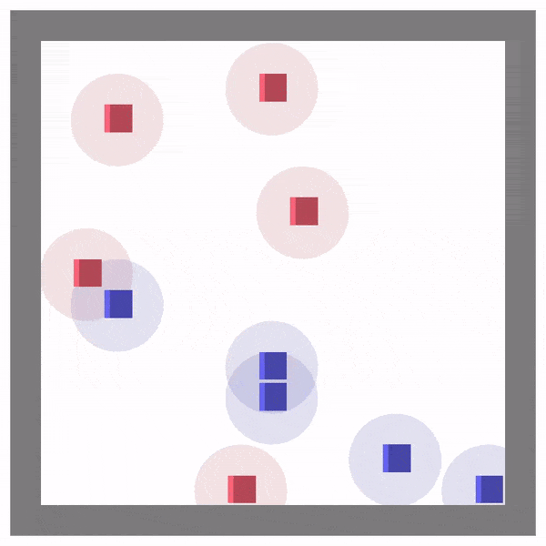

<div align="center">
  <h2 align="center">IE579 - Game Theory and Multi-Agent Reinforcement Learning </h2>
  <p align="center">
    Final Project Repository for IE579
  </p>
</div>

## 1. About The Project
### 1.1. Project Notice
**(Important !!)** We uploaded the standard environment for final project. 
~~We aim to update the IPPO code at the earliest opportunity, ideally within one day (before the end of this Saturday).
We apologize for any delay.~~ We uploaded the RL training code.
The update log will be posted in [here](#5-update-logs), and you can download the standard environment by following [these](#31-standard-environment-class-for-final-project) instructions.

The due date for the project will be updated soon.
You have the option to form a team consisting of 1 to 2 people. 
If you want to find a teammate, kindly contact the TA via email, 
and we will make an effort to assist you in finding a suitable teammate.

### 1.2. Environment Description
We will use **MAgent-Battle** for final project. 
It is an environment for multi-agent reinforcement learning (MARL).
Each agent (small blue or red box) can move or attack enemy and The objective of each team (blue or red) is to kill all opponents in the game.
<div align="center">
  
</div>

We will use simplified environment. There are 5 blue and 5 red in 15X15 size map.
Description for state, observation for each agent, action and reward is as follows:

- **_State_** space is a 15X15 map with 7 channels as shown in the below figure. State space will (15, 15, 7). 
Note that your actor network for submission should not use state as an input. 
Using state for training is totally fine. 
For example, you can use state as an input to train critic network.

- **_Observation_** space is a 11x11 map with 7 channels as shown in below figure.
There will be additional information (last action, reward, and relative position) in 34 dimensions.
Finally, Observation space will (11, 11, 7) + 34 = 881 dim.
Your actor network for final submission should use observation as an input.
Please refer this [link](https://github.com/geek-ai/MAgent/blob/master/doc/get_started.md#observation) for details.
<div align="center">

</div>

- **_Action_** space is discrete and 21 dimensions. 13 dimensions for moving and 8 dimensions 
for attacking as shown in the below figure.
<div align="center">

</div>


- **_Reward_** is a summation of multiple reward components. Note that you are free to change the reward design by yourself.
  - +5 for killing an opponent.
  - -0.005 for every timestep.
  - -0.1 for attacking.
  - +0.2 for attacking an opponent (when attack is success).
  - -0.1 for dying.

### 1.3. Evaluation
To compare two models, we test 200 times with 100 different random seed and switching.
For example, if we test model A and B, test will be as follows:
- (blue=A, red=B, seed=1), (blue=B, red=A, seed=1), (blue=A, red=B, seed=2), (blue=B, red=A, seed=2), …, (blue=B, red=A, seed=100)

Each team's submitted model is tested against all other models.

Note that your model should use only the observation of your team, not the opponent's as an input.
The observation configuration should be kept. Also, only decentralized actor is allowed. 
You don't need to submit the RL-based model; a rule-based model is also acceptable.

You are free to make adjustments to all the provided components as you see fit. 
**However, it's crucial to note that the evaluation will be conducted using the provided code.** 
Therefore, if you change the 'environment class' please carefully modify the given code.
For instance, if you alter the observation configuration by yourself, 
the modified code will not work correctly during the evaluation process in the final submission.

### 1.4. Training Strategy Example
Because the game is competitive, we need a (good) opponent behavior model for training. 
However, static or unskilled opponenet might lead to overfitting.
To mitigate the issue, there are multiple approaches:
- **Self-play**: Agents can enhance their performance by playing against themselves. ([link](https://huggingface.co/learn/deep-rl-course/unit7/self-play?fw=pt))
- **Population-play**: Train a population of agents, with each agent playing against the others.


## 2. Getting Started
### 2.1. WSL installation (Optional, for Windows user)
WSL (Windows Subsystem for Linux) is designed to make it easy to use Linux tools within Windows, 
eliminating the need to install a virtual machine. 
Since MAgent exclusively supports Linux, if you don't have access to a Linux machine, we recommend using WSL to run MAgent.
1. Open PowerShell as an administrator
2. Install WSL
```bash
wsl --install
```
3. Type username and password

If it doesn't work, type `wsl --install -d Ubuntu-18.04`. 
You can select the version of Ubuntu by using `wsl --list --online`.
Please refer this [link](https://ubuntu.com/tutorials/install-ubuntu-on-wsl2-on-windows-10#1-overview)
 to get more information.

### 2.2. Anaconda installation
1. Open the Ubuntu terminal or WSL
2. Install Anaconda. (You can install different version of anaconda [here](https://repo.anaconda.com/archive/))
```bash
wget -c https://repo.continuum.io/archive/Anaconda3-2023.09-0-Linux-x86_64.sh
bash Anaconda3-2023.09-0-Linux-x86_64.sh
```
3. Accept the license term and activate the anaconda
```bash
source ~/anaconda3/bin/activate
```
4. Create env and activate created environment.
```bash
conda create --name game_theory python=3.7
conda activate game_theory
```


### 2.3. MAgent installation
Next, let's install MAgent. Begin by cloning the MAgent repository and then follow the provided instructions.
It's recommended to execute the commands step by step.
1. Clone the repo
```bash
git clone https://github.com/geek-ai/MAgent.git
```
2. Install MAgent
```bash
cd MAgent
sudo apt-get update
sudo apt-get install cmake libboost-system-dev libjsoncpp-dev libwebsocketpp-dev
sudo apt-get update && sudo apt-get install build-essential
bash build.sh
export PYTHONPATH=$(pwd)/python:$PYTHONPATH
pip install protobuf==3.20.1
```
3. (Optional) Verify the installation of MAgent
```bash
pip install tensorflow==1.13.1
python examples/train_battle.py --train
```

## 3. Example Code

### 3.1. Standard Environment Class for Final Project
Standard environment code for project is now available! 
Please copy and paste `battle_env.py` and `visualizer.py` into `MAgent/python` directory.
Then, copy and paste `battle_small.py` which is configuration file into 
`MAgent/python/magent/builtin/config` directory.
Code structure should be like as follows:
```
MAgent/  # Cloned repository
├── python/ 
│ ├── magent/
│ │ └─── builtin/
│ │   └─── config/
│ │     └─── battle_small.py  # provided code 1 (small battle config)
│ ├── battle_env.py  # provided code 2 (standard environment)
│ ├── visualizer.py  # provided code 3 (custom visualizer)
│ └── battle_train.py  # provided code 4 (RL training code)
└── ...
```
Finally, try to run the `battle_env.py`.
### 3.2. Independent PPO
We uploaded RL training code `battle_train.py` against random policy.
You need PyTorch to train the PPO model. To install the PyTorch in Linux, run following command. 
(This command only support cpu. You can install CUDA PyTorch using proper command.)  
```bash
pip3 install torch --index-url https://download.pytorch.org/whl/cpu
```
You can get RL agent which can beat random agent with a 99% winning ratio under **5 mins** using this code.

### 3.3. Evaluation code
- **(TBU)** Standard Evaluation code

### 3.4. Visualization
To assist you in debugging, we've created a customized visualization that doesn't entail complex process.
However, as the visualization tool is unofficial, consider it solely as a reference. 
The visualization will undergo additional updates and optimizations in the near future. 
Feel free to customize the visualization tool yourself.
All related custom visualization tools are implemented in the `visualizer.py`.

Note that utilizing visualization may slow down the environment's step processing. 
Therefore, ensure to disable the visualization option when training the model. 
To use the customized visualization, you need to install following libraries.
```bash
pip install matplotlib
pip install imageio
pip install imageio[ffmpeg]
```
For the official visualization, please refer this [link](https://github.com/geek-ai/MAgent/blob/master/doc/get_started.md#watch-video).

## 4. Project Tips
- If you want to develop in Windows using Linux based server or WSL, use SSH or WSL interpreter.
  - If you use PyCharm ([SSH](https://www.jetbrains.com/help/pycharm/configuring-remote-interpreters-via-ssh.html), 
[WSL](https://www.jetbrains.com/help/pycharm/using-wsl-as-a-remote-interpreter.html))
  - If you use VSCode ([SSH](https://code.visualstudio.com/docs/remote/ssh),
[WSL](https://code.visualstudio.com/docs/remote/wsl))
- Use [WandB](https://docs.wandb.ai/quickstart) as a performance visualization tool.
- Deep RL (PPO) implementation tips. ([link](https://iclr-blog-track.github.io/2022/03/25/ppo-implementation-details/))
- MAPPO official implementation. ([link](https://github.com/zoeyuchao/mappo))

## 5. Update Logs
I will document any significant updates to the repository here along with the dates.
- **(Nov. 08. 2023)** Instruction has been provided.
- **(Nov. 10. 2023)** A standard environment class with visualization is now available.
- **(Nov. 11. 2023)** IPPO training code is now available.
- _**(Nov. 12. 2023)** Standard evaluation code and self-play will be updated._

## Contact
**(TA)** Kanghoon Lee - leehoon@kaist.ac.kr

Should you have any questions, please feel free to reach out via email. 
Alternatively, you can leave your questions in KLMS or the Issues tab on the GitHub repository.

Additionally, please feel free to share any suggestions or improvements you would like to see in this repository. 
Your feedback is highly valued by us, and we welcome any suggestions or comments you may have.

## References
1. _Zheng, Lianmin, et al. "Magent: A many-agent reinforcement learning platform for artificial collective intelligence." Proceedings of the AAAI conference on artificial intelligence. Vol. 32. No. 1. 2018._
